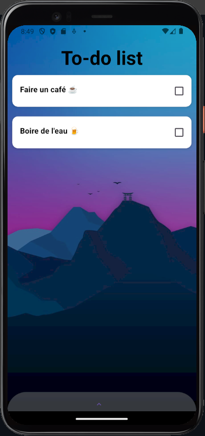

# NFA 022 - TODO list application

This is a simple TODO list application made in React native

## Tech stack

- React native
- react native papers
- expo



## How to run this app

```sh
git clone https://github.com/naikibro/todolist.git
```

```sh
npm i
```

```sh
npx expo start
```

## How to use

1. Add a task: click the bottom drawer
2. Edit a task : click the task
3. Delete a task : swipe the task to the left ( if completed )
4. Mark a task as completed : toggle the checkbox
5. Mark a task as incomplete : toggle the checkbox

## Acknowledgements

- CNAM PF
- Vaanaiki Brotherson @author
